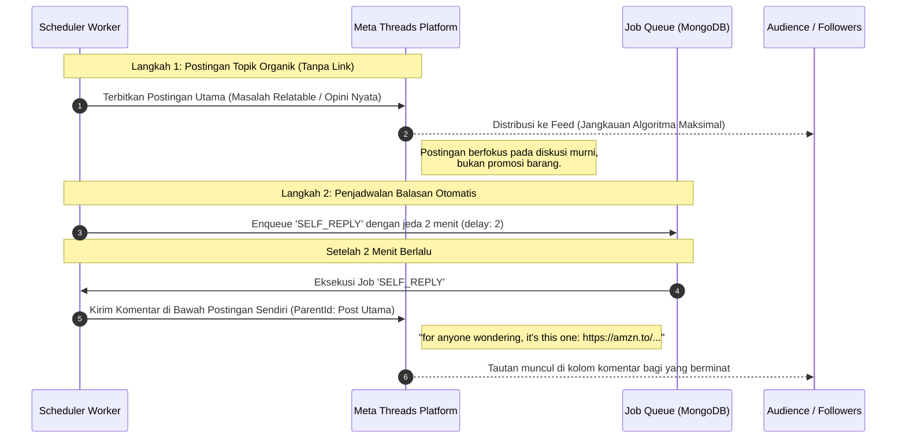

# 📘 DOKUMENTASI TEKNIS & ARSITEKTUR SISTEM LENGKAP
**Threads Autonomous Creator & Affiliate Agent**  
*Comprehensive System Architecture, Autonomous Engine Analysis, API Reference & Operational Guide*

---

## 📑 DAFTAR ISI
1. [Ringkasan Eksekutif & Identitas Proyek](#1-ringkasan-eksekutif--identitas-proyek)
2. [Arsitektur Sistem & Diagram Alur Kerja](#2-arsitektur-sistem--diagram-alur-kerja)
   - 2.1 Alur Siklus Otonom (Autonomous Execution Loop)
   - 2.2 Strategi Corong Afiliasi Terselubung (Stealth Soft-Sell Funnel)
3. [Stack Teknologi & Konfigurasi Runtime](#3-stack-teknologi--konfigurasi-runtime)
4. [Skema Database & Model Data (Mongoose / MongoDB)](#4-skema-database--model-data-mongoose--mongodb)
   - 4.1 AgentState (Singleton Status & Persona)
   - 4.2 Product (Vault Produk Afiliasi)
   - 4.3 Post (Konten & Rekam Jejak Penerbitan)
   - 4.4 Job (Antrean Pekerjaan Asinkron)
   - 4.5 Memory, Conversation, & Person
   - 4.6 Mekanisme Dual-Mode (In-Memory Fallback vs MongoDB Atlas)
5. [AI Inference Engine & Prompt Engineering](#5-ai-inference-engine--prompt-engineering)
   - 5.1 Multi-Key Groq Rotator & Multi-Tier Failover
   - 5.2 Dynamic Persona & Mood Evolution
   - 5.3 Sistem Prompt & Variasi Tipe Konten
   - 5.4 Strategi Komentar & Interaksi Komunitas
6. [Quality Gate, Moderasi & Anti-Repetisi](#6-quality-gate-moderasi--anti-repetisi)
   - 6.1 Filter Spam & Pola Pemasaran Terlarang
   - 6.2 Evaluasi Repetisi Berbasis AI Memory
7. [Integrasi Meta Threads Graph API v1.0](#7-integrasi-meta-threads-graph-api-v10)
   - 7.1 Dua Tahap Penerbitan (Container -> Publish)
   - 7.2 Alur Autentikasi OAuth 2.0 & Token Exchange
   - 7.3 Long-Lived Token Refresh Mechanism
   - 7.4 Simulasi Dry-Run Mode
8. [Katalog Endpoint API Internal](#8-katalog-endpoint-api-internal)
9. [Antarmuka Pengguna Frontend (Next.js Dashboard)](#9-antarmuka-pengguna-frontend-nextjs-dashboard)
10. [Panduan Konfigurasi & Deployment](#10-panduan-konfigurasi--deployment)
    - 10.1 Inventaris Environment Variables (.env)
    - 10.2 Menjalankan Secara Lokal
    - 10.3 Konfigurasi Deployment Vercel & Cron
11. [Temuan Audit, Gap Analysis & Rekomendasi Peningkatan](#11-temuan-audit-gap-analysis--rekomendasi-peningkatan)

---

## 1. RINGKASAN EKSEKUTIF & IDENTITAS PROYEK

Proyek **Threads Autonomous Creator Agent** (pada direktori kerja `amazon affiliate agent`) adalah aplikasi berbasis web full-stack modern yang dirancang untuk bertindak sebagai **kreator media sosial otonom berbasis kecerdasan buatan (AI)** di platform **Meta Threads**.

### Tujuan Utama:
1. **Membangun Audiens Organik**: Menghasilkan konten otentik (opini spontan, pertanyaan diskusi, cerita mikro) yang terdengar seperti manusia asli (bukan bot pemasar) untuk meningkatkan impresi dan pengikut.
2. **Monetisasi Afiliasi Halus (Stealth Affiliate)**: Menyisipkan rekomendasi produk Amazon tanpa merusak algoritma jangkauan organik (menggunakan teknik *delayed self-reply*).
3. **Interaksi Sosial Cerdas**: Mendengarkan dan membalas komentar audiens secara kontekstual dengan berbagai pendekatan psikologis (*agree*, *disagree*, *add value*, *playful*).
4. **Otonomi Tanpa Pengawasan (Zero Human Intervention)**: Beroperasi 24/7 menggunakan penjadwal berbasis Cron, rotasi mood otomatis, dan pelindung batas harian (rate limit & cooldown).

> [!NOTE]
> **Klarifikasi Dokumen Legacy:**  
> File `CREDENTIALS_AND_API_DOCUMENTATION.md` yang ada di root proyek berisi dokumentasi sistem "Medsos Agent" (versi Express + Vite + Shopee + Cloudinary + Telegram). Sedangkan **kode aktif repositori ini** adalah sistem terfokus yang dibangun secara bersih menggunakan **Next.js 14 App Router** khusus untuk ekosistem **Threads & Amazon Affiliate**.

---

## 2. ARSITEKTUR SISTEM & DIAGRAM ALUR KERJA

### 2.1 Alur Siklus Otonom (Autonomous Execution Loop)

Berikut adalah diagram alur ketika sistem dibangunkan oleh Cron atau trigger manual:

```mermaid
flowchart TD
    A[Vercel Cron / Manual Trigger /api/agent/cycle] --> B[StateManager: Ambil Status & Rotasi Mood]
    B --> C{Ada Antrean Job Pending?}
    C -- Ya --> D[Claim Job: Atomik Lock di DB]
    C -- Tidak --> E[Evaluasi Cooldown & Jadwal]
    E --> F{Boleh Post Baru?}
    F -- Ya --> G[Enqueue Job: COMPOSE_POST]
    F -- Tidak --> H[Enqueue Job: CHECK_REPLIES]
    G --> D
    H --> D
    D --> I[Worker Runner: Eksekusi Job]
    I --> J{Tipe Job}
    
    J -- COMPOSE_POST --> K[Pilih Topik & Tipe Konten]
    K --> L{Boleh Sebut Produk?}
    L -- Ya 35% Roll --> M[Ambil Produk dari Vault]
    L -- Tidak 65% Roll --> N[Konten Murni Pikiran/Pertanyaan/Cerita]
    M --> O[Inference AI Groq Rotator]
    N --> O
    O --> P[Quality Gate Moderation]
    P -- Gagal --> Q[Tolak / Regenerasi]
    P -- Lolos --> R[Memory Check: Uji Repetisi]
    R -- Terlalu Mirip --> S[Log Peringatan / Regenerasi]
    R -- Unik --> T{Autonomy Level & Dry Run}
    T -- Level >= 1 & Live --> U[Kirim ke Meta Threads API]
    T -- Level 0 / Dry Run --> V[Simulasi / Simpan Status DRAFT]
    U --> W[Simpan Record Post di MongoDB]
    V --> W
    W --> X[Perbarui Cooldown & Memori Agen]
    
    J -- CHECK_REPLIES --> Y[Threads API: Tarik Percakapan 7 Hari Terakhir dari 20 Post Utama (Excl. Self-Replies)]
    Y --> Z[Enqueue GENERATE_REPLY untuk tiap komentar baru]
    
    J -- GENERATE_REPLY --> AA[Pilih Strategi Balasan: Agree/Disagree/Value/Playful]
    AA --> AB[Inference AI & Quality Gate]
    AB --> AC{Autonomy >= 2?}
    AC -- Ya --> AD[Publish Balasan Komentar ke Threads]
    AC -- Tidak --> AE[Simpan sebagai DRAFT di DB]
```

---

### 2.2 Strategi Corong Afiliasi Terselubung (Stealth Soft-Sell Funnel)

Algoritma platform sosial (seperti Threads, X, Instagram) secara sistematis menekan jangkauan postingan yang menyertakan tautan keluar (*external link*) di postingan utama. Sistem ini mengatasi batasan tersebut dengan arsitektur 2 langkah:



---

## 3. STACK TEKNOLOGI & KONFIGURASI RUNTIME

| Layer | Teknologi | Versi | Rincian / Kegunaan |
|---|---|---|---|
| **Framework Web** | Next.js (App Router) | 14.2.24 | Server-Side Rendering, Serverless Route Handlers, React Server Components |
| **Bahasa** | TypeScript | 5.7.3 | Jaminan tipe ketat (`strict: true`) di seluruh modul |
| **UI Library** | React | 18.3.1 | Komponen antarmuka dashboard klien |
| **Styling** | Tailwind CSS | 3.4.17 | Utilitas CSS modern, mode gelap adaptif |
| **Ikonografi** | Lucide React | 0.475.0 | Ikon dashboard SVG presisi tinggi |
| **Database ODM** | Mongoose | 8.9.5 | Pemodelan skema MongoDB dan manajemen koneksi |
| **AI Runtime** | Fetch API / REST | Native | Kompatibel OpenAI format ke Groq, xKiro, dan Mistral |
| **Platform Target** | Meta Threads Graph API | v1.0 | Endpoint resmi penerbitan konten dan social listening |

---

## 4. SKEMA DATABASE & MODEL DATA (MONGOOSE / MONGODB)

Semua skema database berlokasi di direktori [db/models/](file:///c:/App%20Tools/amazon%20affiliate%20agent/db/models/).

### 4.1 `AgentState.ts` (Singleton State)
Menyimpan seluruh konfigurasi dinamis, kepribadian, mood, serta counter pembatasan operasional.
```typescript
{
  currentMood: 'CURIOUS' | 'CONTEMPLATIVE' | 'SARCASTIC' | 'CHILL' | 'HELPFUL',
  persona: {
    identityName: string,       // "Avery" (@averyfoundit)
    avatarUrl?: string,         // Foto profil Cloudinary / local avatar
    tagline: string,            // Bio / Filosofi kreator (desk setups, cozy tech & coffee)
    humorLevel: number,         // Skala 1-10 (default: 7)
    sarcasmLevel: number,       // Skala 1-10 (default: 3)
    warmth: number,             // Skala 1-10 (default: 9)
    slangFrequency: number,     // Skala 1-10 (default: 5)
    emojiFrequency: number,     // Skala 0-5 (default: 2)
    salesiness: number,         // Skala 0-5 (default: 1, stealth mode)
    opinionatedness: number,    // Skala 1-10 (default: 7)
    postLength: 'short' | 'medium' | 'varied',
    nicheTopics: string[],      // Topik fokus (desk setup, WFH, minimalist tech, coffee)
    topicsToAvoid: string[],    // Pantangan (politik, crypto spam, hard selling)
  },
  recentTopics: string[],       // Rolling memory topik terakhir
  recentHooks: string[],        // Kalimat pembuka yang baru dipakai
  recentPhrases: string[],      // Frasa yang dihindari agar tidak klise
  recentProducts: string[],     // Produk yang baru saja disebut
  cooldowns: {
    productMentionUntil: Date,  // Cooldown antar promosi produk (default: 2 jam)
    selfReplyUntil: Date,       // Jeda antar balasan mandiri
    nextPostAllowedAt: Date,    // Jeda antar post utama (default: 45 menit - 2.5 jam)
  },
  dailyActions: {
    date: string,               // YYYY-MM-DD untuk auto-reset tengah malam
    postsCount: number,         // Jumlah postingan hari ini (Max: 8 post / hari)
    repliesCount: number,       // Jumlah balasan hari ini
    productMentionsCount: number// Jumlah penyebutan produk hari ini
  },
  commercialBudget: {
    dailyLimit: number,         // Default: 4.0 poin / hari
    currentSpent: number,       // Bobot terpakai (direct_link=1.0, soft_rec=0.4, mention=0.15)
    lastResetDate: string
  },
  autonomyLevel: 0 | 1 | 2 | 3, // 0=Manual, 1=Simulasi, 2=Auto-Post, 3=Full-Auto
  dryRunMode: boolean           // True = Jangan kirim ke Threads asli
}
```

### 4.2 `Product.ts` (Katalog Vault Produk Afiliasi)
Menyimpan inventaris produk Amazon yang dapat direkomendasikan agen, diperkaya oleh scraper ekstensi Chrome dan rehoster Cloudinary.
```typescript
{
  name: string,                 // Nama produk (e.g. "Anker 735 65W GaN Charger")
  brand?: string,               // Nama brand/manufaktur (e.g. "Anker")
  asin?: string,                // Amazon Standard Identification Number (e.g. "B07ZP697CB")
  affiliateUrl: string,         // Tautan afiliasi Amazon (amzn.to/...)
  category: string,             // Kategori (desk setup, audio, productivity)
  notes: string,                // Poin keunggulan dan pengalaman pemakaian agen
  creatorNotes?: string,        // Catatan sudut pandang kreator dari Vision AI
  price?: string,               // Harga produk (e.g. "$29.99")
  listPrice?: string,           // Harga coret (e.g. "$39.99")
  discount?: string,            // Diskon persentase (e.g. "25%")
  rating?: string,              // Rating bintang (e.g. "4.7")
  reviewCount?: string,         // Jumlah ulasan (e.g. "1,420")
  bullets?: string[],           // Fitur ringkas dari listing
  imageUrl?: string,            // URL gambar utama yang di-rehost di Cloudinary
  videoUrl?: string,            // URL video MP4 yang di-rehost di Cloudinary
  images?: string[],            // Kumpulan gambar Cloudinary (maks 3-4)
  videos?: string[],            // Kumpulan video Cloudinary (maks 1)
  lastMediaUsedUrl?: string,    // URL media terakhir untuk rotasi anti-fatigue LRU
  lastMediaTypeUsed?: 'NONE' | 'IMAGE' | 'VIDEO',
  visualContext?: {             // Hasil ekstraksi visual dari Vision AI
    aestheticStyle?: string,
    dominantColors?: string[],
    materials?: string[],
    keyVisualHooks?: string[]
  },
  active: boolean,              // Status ketersediaan (otomatis false jika out-of-stock)
  timesMentioned: number,       // Counter seberapa sering produk disebut
  timesLinked: number,          // Counter seberapa sering link dibagikan di self-reply
  lastMentionedAt: Date,        // Waktu terakhir direkomendasikan
  lastLinkedAt: Date            // Waktu terakhir link dikirim
}
```

### 4.3 `Post.ts` (Riwayat Konten)
```typescript
{
  threadsId?: string,           // ID post yang dikembalikan oleh Meta Graph API
  creationId?: string,          // ID container media Meta
  type: 'ORIGINAL_THOUGHT' | 'QUESTION' | 'STORY' | 'CONTEXTUAL_PRODUCT' | 'SELF_REPLY' | 'COMMUNITY_REPLY',
  text: string,                 // Isi konten postingan (<= 500 karakter)
  productId?: ObjectId,         // Relasi ke produk jika mempromosikan barang
  parentId?: string,            // Target ID post jika berupa balasan
  replyClass?: 'AGREE' | 'DISAGREE' | 'ADD_VALUE' | 'PLAYFUL',
  status: 'DRAFT' | 'QUEUED' | 'PUBLISHED' | 'REJECTED',
  simulationData: {
    fitScore: number,           // Skor kelayakan dari Quality Gate (0-100)
    reasoning: string,          // Alasan & catatan AI di balik pembuatan
    targetTopic?: string
  },
  publishedAt?: Date
}
```

### 4.4 `Job.ts` (Antrean Pekerjaan Asinkron)
Memungkinkan penanganan pekerjaan berulang dan penjadwalan masa depan yang tahan gangguan (*fault-tolerant*).
```typescript
{
  type: 'DISCOVER_TOPICS' | 'CHECK_REPLIES' | 'COMPOSE_POST' | 'GENERATE_REPLY' | 'PUBLISH_ITEM',
  payload: Record<string, any>,
  status: 'PENDING' | 'PROCESSING' | 'COMPLETED' | 'FAILED',
  scheduledFor: Date,           // Waktu eksekusi yang dijadwalkan
  attempts: number,             // Percobaan yang sudah dilakukan
  maxAttempts: number,          // Maksimal coba ulang (default: 3)
  lockedAt?: Date,              // Penguncian atomik untuk mencegah race condition
  errorLog?: string
}
```

### 4.5 `Memory.ts`, `Conversation.ts`, & `Person.ts`
- **`Memory.ts`**: Menyimpan wawasan lepas (*short & long-term knowledge*) dengan skala `importance` (1-10) untuk injeksi ke konteks AI.
- **`Conversation.ts`**: Melacak thread diskusi di Threads tempat agen berpartisipasi beserta rangkuman konteksnya.
- **`Person.ts`**: Melacak relasi dengan pengguna Threads lain (`STRANGER` -> `ACQUAINTANCE` -> `FRIENDLY` -> `REGULAR`), mencatat frekuensi interaksi, minat mereka, dan preferensi komunikasi.

### 4.6 Mekanisme Dual-Mode (In-Memory Fallback vs MongoDB Atlas)
Salah satu fitur teknis tercanggih pada arsitektur ini adalah **Resilient Dual-Mode**:
- Jika `MONGODB_URI` tersedia di environment: Sistem secara otomatis membuka pool koneksi Mongoose ke MongoDB Atlas.
- Jika `MONGODB_URI` kosong (misalnya saat instalasi lokal baru atau demonstrasi instan): Sistem **tidak mengalami crash**, melainkan beralih otomatis ke **In-Memory Mock Storage** ([lib/memory/stateManager.ts](file:///c:/App%20Tools/amazon%20affiliate%20agent/lib/memory/stateManager.ts), [lib/scheduler/queue.ts](file:///c:/App%20Tools/amazon%20affiliate%20agent/lib/scheduler/queue.ts), dan [app/api/posts/route.ts](file:///c:/App%20Tools/amazon%20affiliate%20agent/app/api/posts/route.ts)). Hal ini memungkinkan pengujian seluruh fitur UI dan alur agen tanpa hambatan koneksi database.

---

## 5. AI INFERENCE ENGINE & PROMPT ENGINEERING

### 5.1 Multi-Key Groq Rotator & Multi-Tier Failover
Terletak di [lib/ai/groqRotator.ts](file:///c:/App%20Tools/amazon%20affiliate%20agent/lib/ai/groqRotator.ts). Didesain khusus agar kecepatan respons berada di bawah 1 detik (<1000ms) guna memenuhi batas timeout Vercel Serverless Function (10-15 detik).

1. **Rotasi Kunci Dinamis**: Membaca string `GROQ_API_KEYS` yang dipisahkan koma. Menggunakan pointer `currentKeyIndex` untuk membagi beban permintaan secara merata (*round-robin*).
2. **Penanganan Otomatis Rate-Limit (HTTP 429)**: Jika salah satu API key mencapai limit RPM/TPM, sistem segera beralih ke kunci berikutnya tanpa membatalkan proses yang sedang berjalan.
3. **Piramida Failover Bertingkat**:
   - **Tier 1 (Utama)**: Groq Cloud LPU (`llama-3.3-70b-versatile` atau `llama-3.1-8b-instant`).
   - **Tier 2 (Eksperimen/Kualitas Tinggi)**: xKiro AI API (`qwen/qwen3.8-max` via endpoint OpenAI compatible).
   - **Tier 3 (Cadangan Terakhir)**: Mistral AI (`mistral-small-latest`).
   - **Tier 4 (Offline)**: Heuristic Mock Generator jika seluruh API eksternal offline.

### 5.2 Dynamic Persona & Mood Evolution
Agen memiliki 5 mode emosional yang berotasi secara alami di setiap siklus:
- `CURIOUS`: Fokus pada observasi hal-hal kecil di meja kerja atau gadget sehari-hari.
- `CONTEMPLATIVE`: Pemikiran filosofis tentang rutinitas kerja jarak jauh dan produktivitas.
- `SARCASTIC`: Gurauan sarkas yang cerdas mengenai kebiasaan digital yang konyol.
- `CHILL`: Santai, berbagi pengalaman akhir pekan atau kopi pagi.
- `HELPFUL`: Memberikan tips teknis singkat yang bernilai praktis.

### 5.3 Sistem Prompt & Variasi Tipe Konten
Prompt sistem ([lib/prompts/personaPrompt.ts](file:///c:/App%20Tools/amazon%20affiliate%20agent/lib/prompts/personaPrompt.ts)) menerjemahkan slider konfigurasi menjadi instruksi kepribadian yang jelas:
- **Aturan Emas Threads**: Tulisan wajib bergaya percakapan santai (huruf kecil alami, tanpa format kaku, tanpa kata-kata korporat seperti "revolusioner", "solusi mutakhir", dll).
- **5 Template Tipe Konten** ([lib/prompts/contentPrompts.ts](file:///c:/App%20Tools/amazon%20affiliate%20agent/lib/prompts/contentPrompts.ts)):
  1. `ORIGINAL_THOUGHT`: Realisasi spontan di bawah 280 karakter.
  2. `QUESTION`: Pertanyaan terbuka yang mengundang audiens membagikan pengalaman setup meja mereka.
  3. `STORY`: Cerita mikro 2-3 kalimat mengenai kendala harian dan bagaimana hal itu teratasi.
  4. `CONTEXTUAL_PRODUCT`: Pengalaman pemakaian produk tanpa mencantumkan link dan tanpa gaya iklan.
  5. `SELF_REPLY`: Balasan komentar satu kalimat pendek dengan link amzn.to untuk audiens yang penasaran.

### 5.4 Strategi Komentar & Interaksi Komunitas
Pada saat membalas pengguna lain ([lib/prompts/replyPrompts.ts](file:///c:/App%20Tools/amazon%20affiliate%20agent/lib/prompts/replyPrompts.ts)), agen memilih satu dari 4 persona taktis:
- `AGREE`: Setuju dan menambahkan validasi dari pengalaman pribadi.
- `DISAGREE`: Memberikan perspektif berlawanan secara halus dan elegan (*"idk, i used to think so too until..."*).
- `ADD_VALUE`: Memberikan tips praktis atau *lifehack* yang relevan.
- `PLAYFUL`: Memberikan lelucon ringan yang mencairkan suasana.

---

## 6. QUALITY GATE, MODERASI & ANTI-REPETISI

Terletak di [lib/moderation/qualityGate.ts](file:///c:/App%20Tools/amazon%20affiliate%20agent/lib/moderation/qualityGate.ts) dan [lib/memory/memoryEngine.ts](file:///c:/App%20Tools/amazon%20affiliate%20agent/lib/memory/memoryEngine.ts).

### 6.1 Filter Spam & Pola Pemasaran Terlarang
Setiap konten yang dihasilkan AI wajib melewati pengujian *Quality Gate* dengan skor awal 95 poin (ambang batas kelulusan: 60 poin):
1. **Panjang Karakter & Smart Sentence Trimmer**:
   - Batas mutlak Threads: 500 karakter.
   - **Smart Trimmer**: Jika output AI sedikit melebihi 500 karakter (antara 500-600 karakter), sistem tidak langsung menolaknya, melainkan secara cerdas memotong teks di batas akhir kalimat terdekat (`. `, `! `, `? `, `\n\n`) dalam 480 karakter pertama. Hal ini menjaga kalimat tetap utuh dan draf berkualitas tinggi tetap ter-publish.
   - Jika setelah pemotongan panjang tetap > 500 karakter: Dikenakan penalti -40 poin (status draf DRAFT).
2. **Regex Spam Pemasaran Terlarang** (-30 poin per pelanggaran):
   - `/click the link/i`
   - `/link in bio/i`
   - `/use code \w+/i`
   - `/\b(20|30|40|50|60|70)%\s*off\b/i`
   - `/#amazonfinds/i`, `/#musthave/i`, `/#affiliate/i`, `/#ad\b/i`
   - `/limited time deal/i`, `/swipe up/i`, `/hurry up/i`
3. **Penyalahgunaan Hashtag**: Penalti -25 poin jika mengandung lebih dari 2 hashtag (pengguna Threads autentik sangat jarang menumpuk hashtag).
4. **Huruf Kapital & Tanda Seru Berlebih**: Penalti jika huruf besar > 40% (-20 poin) atau tanda seru `!` > 3 buah (-15 poin).
5. **Sanitisasi Format Markdown**: Otomatis membersihkan karakter bintang Markdown (`*teks*` atau `**teks**`) karena Meta Threads tidak mendukung Markdown dan akan menampilkan bintang secara literal.

### 6.2 Evaluasi Repetisi Berbasis AI Memory
Untuk mencegah agen mengulang lelucon, topik, atau sudut pandang yang sama:
- Modul [lib/prompts/memoryDiffPrompt.ts](file:///c:/App%20Tools/amazon%20affiliate%20agent/lib/prompts/memoryDiffPrompt.ts) mengirimkan draf baru beserta 8 postingan terakhir ke AI pembanding berkecepatan tinggi (suhu rendah 0.1).
- Menghasilkan output JSON: `{ isRepetitive: boolean, similarityScore: number, reason: string }`.
- Jika `similarityScore > 70%`, draf ditolak atau ditandai agar tidak terjadi pengulangan membosankan pada linimasa.
- Memiliki sistem *fallback* berupa pencocokan kata tumpang tindih (*word overlap heuristic*) jika parsing AI mengalami kendala.

---

## 7. INTEGRASI META THREADS GRAPH API V1.0

Terletak di [lib/threads/client.ts](file:///c:/App%20Tools/amazon%20affiliate%20agent/lib/threads/client.ts) dan [lib/threads/tokens.ts](file:///c:/App%20Tools/amazon%20affiliate%20agent/lib/threads/tokens.ts).

### 7.1 Protokol Penerbitan Meta Threads Graph API v1.0 (Form-URL-Encoded)
Meta Threads Graph API menerapkan protokol penerbitan dua langkah yang mewajibkan parameter media dikirim via **`application/x-www-form-urlencoded` (`new URLSearchParams()`)**, bukan `application/json` (format JSON menyebabkan crawler Meta gagal mengunduh media dengan *Error Subcode 2207052*):

1. **Pembuatan Media Container (`createContainer`)**:
   - `POST https://graph.threads.net/v1.0/{userId}/threads`
   - Body (`URLSearchParams`): `access_token`, `text`, `media_type` (`TEXT`, `IMAGE`, `VIDEO`, `CAROUSEL`), `reply_to_id` (opsional jika membalas), `image_url` / `video_url` (opsional).
   - Mengembalikan: `{ id: creation_id }`.

2. **Pembuatan Multi-Image Carousel (`publishCarousel`)**:
   - **Langkah A**: Membuat container anak individu (2-5 gambar) dengan parameter `media_type=IMAGE`, `image_url`, dan `is_carousel_item=true`.
   - **Langkah B**: Menunggu status transcoding setiap item anak menjadi `FINISHED`.
   - **Langkah C**: Membuat container induk Carousel dengan `media_type=CAROUSEL` dan `children={child1_id},{child2_id},...`.

3. **Polling Transcoding Media Asinkron (`waitForMediaReady`)**:
   - Memantau endpoint `GET https://graph.threads.net/v1.0/{creationId}?fields=status,error_message` setiap 2 detik.
   - Batas tunggu adaptif: hingga **40 detik untuk video MP4** dan **15 detik untuk gambar**.
   - Berhasil jika status berubah menjadi `FINISHED`. Melempar error jika berstatus `ERROR` atau `EXPIRED`.

4. **Penerbitan Kontainer (`publishContainer`)**:
   - `POST https://graph.threads.net/v1.0/{userId}/threads_publish`
   - Body (`URLSearchParams`): `access_token`, `creation_id`.
   - Mengembalikan: `{ id: threads_post_id }`.

5. **Deep Reply Scanning (`handleCheckReplies`)**:
   - Memindai hingga **20 postingan utama teratas** dalam rentang **7 hari terakhir**.
   - Mengecualikan `type: 'SELF_REPLY'` (komentar link affiliate internal bot) agar tidak memakan slot pemindaian thread diskusi organik.
   - Menjamin komentar audiens pada postingan beberapa hari lalu tetap terdeteksi dan dibalas secara otonom.

### 7.2 Alur Autentikasi OAuth 2.0 & Token Exchange
1. Pengguna mengklik tombol **Connect Threads** di halaman `/settings`.
2. Request diarahkan ke [/api/auth/threads](file:///c:/App%20Tools/amazon%20affiliate%20agent/app/api/auth/threads/route.ts), yang mengarahkan browser ke:
   ```
   https://threads.net/oauth/authorize?client_id={appId}&redirect_uri={origin}/api/auth/threads/callback&scope=threads_basic,threads_content_publish,threads_read_replies,threads_manage_replies&response_type=code
   ```
3. Setelah disetujui pengguna, Threads mengarahkan kembali ke [/api/auth/threads/callback](file:///c:/App%20Tools/amazon%20affiliate%20agent/app/api/auth/threads/callback/route.ts) dengan parameter `?code=...`.
4. Backend menukarkan `code` dengan token berumur pendek (*short-lived token*, berlaku 1 jam).
5. Backend segera menukarkan token pendek tersebut menjadi **Token Jangka Panjang (Long-Lived Token)** yang berlaku **60 hari**:
   ```
   GET https://graph.threads.net/access_token?grant_type=th_exchange_token&client_secret={appSecret}&access_token={shortToken}
   ```
6. Mengambil data profil pengguna (`/me`) dan menyimpan kredensial ke state sistem.

### 7.3 Long-Lived Token Refresh Mechanism
Sesuai dokumentasi Meta, token 60 hari dapat diperpanjang tanpa login ulang jika diperbarui saat masa aktifnya tersisa:
```
GET https://graph.threads.net/refresh_access_token?grant_type=th_refresh_token&access_token={token}
```
### 7.4 Integrasi Meta Threads Insights & Analitik Real-Time
Sistem terhubung langsung ke endpoint resmi Meta Threads Insights:
1. **Metrik Postingan (`/{mediaId}/insights`)**: Mengambil data `views`, `likes`, `replies`, `reposts`, `quotes` secara per-postingan.
2. **Metrik Tingkat Profil (`/{userId}/threads_insights`)**: Mengambil data `views` harian, total `followers_count`, dan total interaksi akun.
Fungsi `getPostInsights()` dan `getUserInsights()` pada [lib/threads/client.ts](file:///c:/App%20Tools/amazon%20affiliate%20agent/lib/threads/client.ts) melayani endpoint internal `/api/threads/insights`.

### 7.5 Simulasi Dry-Run Mode
Jika `DRY_RUN=true` atau kredensial Threads belum terkonfigurasi:
- `ThreadsClient` tidak melakukan panggilan HTTP ke Meta.
- Menghasilkan ID acak simulasi: `mock_threads_{timestamp}_{hash}`.
- Menghasilkan permalink simulasi: `https://threads.net/@mock_user/post/{id}`.
- Memungkinkan pengujian menyeluruh tanpa khawatir memposting hal yang tidak diinginkan ke akun publik.

---

## 8. KATALOG ENDPOINT API INTERNAL

Semua rute backend menggunakan **Next.js 14 App Router Route Handlers**:

| Endpoint | Method | Fungsi & Deskripsi | Request Body / Query Params |
|---|---|---|---|
| `/api/cron/wake` | `GET` | Endpoint penjadwal otonom 24/7 (dipanggil GAS setiap 5m). Batas posting harian: 14 post/hari (`MAX_DAILY_POSTS = 14`), jitter 25-45m, `maxDuration = 60s`, dan deep reply scanner 7 hari / 20 post. | Headers: `Authorization: Bearer <CRON_SECRET>` atau query `?secret=...` |
| `/api/agent/cycle` | `POST` | Menjalankan satu siklus otonom: claim job antrean atau buat job baru berdasarkan cooldown & mood | `{}` (Tidak memerlukan body) |
| `/api/agent/compose` | `POST` | Memicu pembuatan draf postingan baru secara langsung berdasarkan topik atau produk tertentu | JSON: `{ type?: PostType, topic?: string, productId?: string }` |
| `/api/agent/discover`| `POST` | Meminta AI mencari 3 topik atau hook percakapan segar yang relevan dengan niche saat ini | `{}` |
| `/api/agent/reply` | `POST` | Menginstruksikan agen menghasilkan balasan untuk komentar audiens tertentu | JSON: `{ incomingText: string, authorUsername?: string, replyToId?: string }` |
| `/api/posts` | `GET` | Mengambil daftar postingan agen dengan filter status | Query: `?status=ALL\|DRAFT\|PUBLISHED\|REJECTED&limit=50` |
| `/api/posts` | `POST` | Melakukan tindakan manual terhadap draf (Approve, Reject, Update Text) | JSON: `{ action: "APPROVE"\|"REJECT"\|"UPDATE", postId: string, updatedText?: string }` |
| `/api/products` | `GET` | Mengambil seluruh daftar produk afiliasi dari vault | - |
| `/api/products` | `POST` | Menambah produk baru ke vault (mendukung single add atau bulk import dengan pipa `\|`) | JSON: `{ name, affiliateUrl, category, notes }` ATAU `{ bulkText: "Name \| Link \| Category \| Notes" }` |
| `/api/products/[id]`| `PUT/DELETE`| Mengedit atau menghapus produk dari vault | JSON update fields atau DELETE request |
| `/api/products/ingest`| `POST/OPTIONS`| Endpoint khusus ingest dari Chrome Extension dengan auto-rehost Cloudinary & CORS preflight | Headers: `x-api-key: <CRON_SECRET>`, Body: `AmazonProductExportPayload` |
| `/api/media-stock` | `GET/POST` | Mengambil daftar stok media viral atau menambah video baru dengan opsi auto-analyze AI Vision | Query: `?category=...&active=true`, Body: `{ videoUrl, title?, category?, notes? }` |
| `/api/media-stock/[id]` | `GET/PUT/DELETE` | Mengambil detail, memperbarui, atau menghapus item stok media dari database | - |
| `/api/media-stock/export` | `GET/POST/OPTIONS`| Endpoint 1-klik ekspor video dari ekstensi: verifikasi anti-duplikat, auto-rehost Cloudinary, AI Vision, dan filter durasi <= 90s | Headers: `x-api-key: <CRON_SECRET>`, Body: `{ videoUrl, title, sourceUrl, thumbnailUrl, duration, category }` |
| `/api/media-stock/upload` | `POST` | Endpoint upload file video langsung dari disk komputer ke Cloudinary & MediaStock | `multipart/form-data` dengan field `file` |
| `/api/trends` | `GET` | Mengambil daftar topik tren viral Amerika Serikat dari database | Query: `?limit=10` |
| `/api/trends/sync` | `POST` | Memicu sinkronisasi instan dari feed Google Trends US, Google News US, dan Reddit US | `{}` |
| `/api/auth/login` | `POST` | Autentikasi login pengguna dashboard dan membuat session cookie HTTP-only yang aman | JSON: `{ username, password }` |
| `/api/auth/logout` | `POST` | Menghapus session cookie dan keluar dari dashboard | `{}` |
| `/api/auth/session` | `GET` | Memeriksa status sesi login aktif | - |
| `/api/state` | `GET` | Mengambil konfigurasi status agen, persona saat ini, mood, statistik harian, dan status token | - |
| `/api/state` | `PUT` | Memperbarui konfigurasi status agen, slider persona, autonomy level, atau kredensial | JSON: Parsial update dari `IAgentState` |
| `/api/threads/insights` | `GET` | Mengambil metrik analitik asli Meta Threads (views, likes, replies, followers) | Query opsional: `?mediaId=...` |
| `/api/threads/test-connection` | `POST` | Menguji validitas token akses dan User ID langsung ke endpoint Meta `/me` | JSON: `{ userId?: string, accessToken?: string }` |
| `/api/auth/threads` | `GET` | Redirect ke halaman otorisasi OAuth Meta Threads resmi | - |
| `/api/auth/threads/callback` | `GET` | Callback OAuth penukaran authorization code menjadi long-lived access token | Query: `?code=...` |

---

## 9. ANTARMUKA PENGGUNA FRONTEND (NEXT.JS DASHBOARD)

Aplikasi dilengkapi panel antarmuka modern bernuansa *dark mode* berkelas tinggi di direktori [app/](file:///c:/App%20Tools/amazon%20affiliate%20agent/app/):

```
+-------------------------------------------------------------------------------+
|   THREADS AUTONOMOUS CREATOR AGENT                     [🟢 DRY-RUN ACTIVE]     |
+-------------------+-----------------------------------------------------------+
|  [⚡ Dashboard]    |  STATUS LIVE KREATOR                                      |
|  [📝 Activity]     |  Identitas: @amzonaff  |  Mood: CURIOUS  |  Autonomy: Lv.2 |
|  [🎭 Persona]      |  Target Niche: desk setup, remote work, everyday tech     |
|  [📦 Products]     |                                                           |
|  [⚙️ Settings]     |  [ ⚡ Run Full Cycle ]  [ ✍️ Compose Post ]  [ 🔍 Discover ]|
|                   +-----------------------------------------------------------+
|                   |  STATISTIK HARIAN                                         |
|                   |  Postingan: 3/5  |  Balasan: 12/20  |  Produk Disebut: 1  |
|                   +-----------------------------------------------------------+
|                   |  RIWAYAT POSTINGAN TERAKHIR                               |
|                   |  - "the transition from 'i don't need a monitor arm'..."   |
|                   |    [Status: PUBLISHED] [Fit Score: 94%] [Topic: Desk]     |
+-------------------+-----------------------------------------------------------+
```

### Rincian Halaman:
1. **`/dashboard`** ([app/dashboard/page.tsx](file:///c:/App%20Tools/amazon%20affiliate%20agent/app/dashboard/page.tsx)):
   - Menampilkan metrik utama agen: identitas nama, badge mood aktif, tingkat otonomi, dan status perlindungan *dry-run*.
   - Aksi kilat (*Quick Actions*): Tombol **Run Full Cycle** (eksekusi siklus instan), **Compose Post** (buat postingan), dan **Discover Topics** (cari topik baru).
   - Indikator kuota harian & kartu preview postingan terbaru lengkap dengan *Quality Fit Score*.
2. **`/activity`** ([app/activity/page.tsx](file:///c:/App%20Tools/amazon%20affiliate%20agent/app/activity/page.tsx)):
   - Log komprehensif seluruh konten agen.
   - Filter tab berdasarkan status: `ALL`, `DRAFT`, `PUBLISHED`, `REJECTED`.
   - Tombol moderasi manual: tombol **Approve & Publish** untuk menyetujui draf konten sebelum tayang langsung ke Threads.
3. **`/persona`** ([app/persona/page.tsx](file:///c:/App%20Tools/amazon%20affiliate%20agent/app/persona/page.tsx)):
   - Studio kustomisasi kepribadian agen secara interaktif menggunakan slider:
     - Level Humor (1-10)
     - Level Sarkasme (1-10)
     - Kehangatan & Keramahan (1-10)
     - Frekuensi Slang / Bahasa Gaul (1-10)
     - Frekuensi Emoji (0-5)
     - Salesiness / Tingkat Jualan (0-5)
     - Preferensi Panjang Postingan (*short, medium, varied*)
   - Manajemen tag daftar topik fokus (*niche topics*) dan topik yang wajib dihindari (*topics to avoid*).
4. **`/products`** ([app/products/page.tsx](file:///c:/App%20Tools/amazon%20affiliate%20agent/app/products/page.tsx)):
   - Manajemen inventaris produk afiliasi Amazon.
   - Fitur **Bulk Text Import**: Memungkinkan memasukkan puluhan tautan sekaligus dengan format satu baris per produk: `Nama Produk | Tautan Afiliasi | Kategori | Catatan Pengalaman`.
5. **`/settings`** ([app/settings/page.tsx](file:///c:/App%20Tools/amazon%20affiliate%20agent/app/settings/page.tsx)):
   - Konfigurasi integrasi Meta Threads: Tombol OAuth otomatis atau input manual `THREADS_USER_ID` dan `THREADS_ACCESS_TOKEN`.
   - Tombol **Test Connection** untuk verifikasi langsung ke server Meta Graph API.
   - Pengaturan level otonomi:
     - **Level 0 (Manual)**: Semua draf wajib disetujui manusia.
     - **Level 1 (Simulasi)**: Draf dibuat otomatis dan disimulasikan.
     - **Level 2 (Semi-Otonom)**: Postingan organik dan self-reply link diterbitkan otomatis.
     - **Level 3 (Full Otonom)**: Postingan dan balasan interaksi komunitas diterbitkan 100% otomatis.
   - Saklar **Dry-Run Mode**.

---

## 10. PANDUAN KONFIGURASI & DEPLOYMENT

### 10.1 Inventaris Environment Variables (.env)
Contoh file konfigurasi tersedia pada [.env.example](file:///c:/App%20Tools/amazon%20affiliate%20agent/.env.example):

| Variabel | Wajib? | Deskripsi / Contoh Nilai |
|---|---|---|
| `NODE_ENV` | Ya | `development` atau `production` |
| `NEXT_PUBLIC_APP_URL` | Ya | URL aplikasi (e.g. `http://localhost:3000` atau `https://your-domain.vercel.app`) |
| `CRON_SECRET` | Ya | Token keamanan acak untuk mengamankan endpoint `/api/cron/wake` |
| `MONGODB_URI` | Opsional | URI MongoDB Atlas (`mongodb+srv://...`). Jika kosong, sistem otomatis memakai in-memory mock storage |
| `MONGODB_DB_NAME` | Opsional | Nama database (default: `threads_agent`) |
| `THREADS_USER_ID` | Ya* | User ID akun Threads Meta (*Wajib jika tidak dalam mode simulasi) |
| `THREADS_ACCESS_TOKEN` | Ya* | Token akses jangka panjang Threads Graph API |
| `DRY_RUN` | Ya | `true` untuk mode simulasi aman; `false` untuk posting langsung ke akun live |
| `GROQ_API_KEYS` | Ya | Kumpulan API Key Groq dipisahkan koma untuk rotasi round-robin |
| `GROQ_MODEL_PRIMARY` | Tidak | Model utama Groq (default: `llama-3.3-70b-versatile`) |
| `GROQ_MODEL_FAST` | Tidak | Model cepat Groq (default: `llama-3.1-8b-instant`) |
| `XKIRO_API_KEY` | Tidak | Kunci API xKiro untuk failover Tier 2 |
| `MISTRAL_API_KEY` | Tidak | Kunci API Mistral untuk failover Tier 3 |

---

### 10.2 Menjalankan Secara Lokal
1. **Instal Dependensi**:
   ```bash
   npm install
   ```
2. **Siapkan Environment Variables**:
   Salin `.env.example` menjadi `.env.local` dan isi setidaknya `GROQ_API_KEYS`.
3. **Jalankan Server Development**:
   ```bash
   npm run dev
   ```
   Buka peramban di `http://localhost:3000`. Dashboard akan langsung aktif!

---

### 10.3 Konfigurasi Deployment Vercel & Cron
Repositori ini telah dilengkapi file [vercel.json](file:///c:/App%20Tools/amazon%20affiliate%20agent/vercel.json):
```json
{
  "crons": [
    {
      "path": "/api/cron/wake",
      "schedule": "*/15 * * * *"
    }
  ]
}
```
Setiap 15 menit, Vercel Cron secara otomatis mengirimkan permintaan HTTP GET ke `/api/cron/wake`, membangunkan agen, mengevaluasi antrean pekerjaan, dan menjalankan siklus konten secara mandiri.

---

## 11. TEMUAN AUDIT, GAP ANALYSIS & REKOMENDASI PENINGKATAN

Dari hasil audit menyeluruh pada kode sumber, berikut adalah catatan teknis penting dan rekomendasi penyempurnaan:

### 1. Sinkronisasi Dokumen Lama vs Kode Aktif
- **Temuan**: File `CREDENTIALS_AND_API_DOCUMENTATION.md` adalah dokumen warisan sistem multi-platform (Express + Shopee + Vite) dan tidak mencerminkan arsitektur Next.js 14 aktif saat ini.
- **Rekomendasi**: Gunakan file dokumen ini (`TECHNICAL_ARCHITECTURE_DOCS.md`) sebagai **sumber kebenaran tunggal (Single Source of Truth)** untuk arsitektur teknis agen ini.

### 2. Penulisan File `.env.local` di Lingkungan Serverless
- **Temuan**: Modul [lib/utils/envHelper.ts](file:///c:/App%20Tools/amazon%20affiliate%20agent/lib/utils/envHelper.ts) menggunakan `fs.writeFileSync` untuk menyimpan token setelah OAuth callback. Pada platform serverless seperti Vercel atau AWS Lambda, filesystem bersifat *read-only* atau *ephemeral* (hilang saat instance berganti).
- **Rekomendasi**: Pastikan `AgentState` di MongoDB dijadikan sebagai sumber kebenaran utama (*primary source of truth*) untuk menyimpan token yang diperbarui, sehingga tidak bergantung pada perubahan file fisik di serverless.

### 3. Otomasi Perpanjangan Token Meta (Token Rotation Cron)
- **Temuan**: Modul [lib/threads/tokens.ts](file:///c:/App%20Tools/amazon%20affiliate%20agent/lib/threads/tokens.ts) telah mengimplementasikan logika `refreshThreadsToken`, namun belum dipanggil secara terjadwal di `/api/cron/wake`.
- **Rekomendasi**: Tambahkan pemeriksaan berkala pada endpoint `/api/cron/wake` untuk memanggil `refreshThreadsToken()` setiap 30 hari sekali agar token tidak pernah kadaluarsa.

### 4. Pelacak Klik Tautan (Affiliate Click Tracker)
- **Rekomendasi**: Mengembangkan rute redirect seperti `/s/[code]` untuk membungkus tautan afiliasi Amazon. Hal ini memungkinkan pencatatan metrik performa (rasio klik tayang / CTR) langsung ke dalam database sebelum pengunjung diarahkan ke halaman Amazon.

---

## 12. FITUR LANJUTAN: RADAR TREN AS, STOK MEDIA VIRAL & EKSTENSI UNIVERSAL

### 12.1 Radar Tren Viral AS ([lib/radar/trendRadar.ts](file:///c:/App%20Tools/amazon%20affiliate%20agent/lib/radar/trendRadar.ts))
- **100% Anti-Banned & Tanpa API Key**: Memanfaatkan RSS feed publik resmi yang tidak berisiko terblokir.
- **Tiga Sumber Data Terpadu**:
  1. *Google Trends US Daily RSS*: Pencarian paling banyak diperbincangkan di Amerika Serikat (`geo=US`).
  2. *Google News US Tech/Desk Setup RSS*: Berita teknologi terkini dan rilis perangkat keras di AS.
  3. *Reddit US Tech Communities RSS*: Diskusi organik dari komunitas Reddit AS (*r/battlestations*, *r/Workspaces*, *r/gadgets*, *r/desksetup*).
- **Integrasi dengan AI Social Engine**: Agen secara otomatis memprioritaskan topik tren dari radar saat menyusun draf postingan organik, memastikan relevansi tinggi dengan audiens lokal AS.
- **Database Model**: Disimpan dalam model [TrendTopic](file:///c:/App%20Tools/amazon%20affiliate%20agent/db/models/TrendTopic.ts) dengan skor peringkat dan riwayat frekuensi pemakaian (`timesReferenced`).

### 12.2 Stok Media Viral & Autonomous AI Vision
- **Model MediaStock ([db/models/MediaStock.ts](file:///c:/App%20Tools/amazon%20affiliate%20agent/db/models/MediaStock.ts))**:
  - Menyimpan koleksi video MP4 viral non-afiliasi (reels, meme teknologi, satisfying clips, relatable moments).
  - Dilengkapi field `originalVideoUrl`, `sourceUrl`, `duration`, dan `visualContext`.
- **Autonomous AI Vision ([lib/ai/visionRotator.ts](file:///c:/App%20Tools/amazon%20affiliate%20agent/lib/ai/visionRotator.ts))**:
  - Model multimodal (*Mistral Pixtral / Qwen-VL*) secara otomatis menonton video, mengekstrak hook visual, menghasilkan judul viral, dan mengklasifikasikan kategori secara mandiri tanpa input manual pengguna.
  - Video otomatis di-rehost secara permanen ke bucket video Cloudinary.

### 12.3 Ekstensi Browser Universal Video Sniffer & In-Page Overlay
- **In-Page Floating Export Button ([videoSniffer.js](file:///c:/App%20Tools/amazon%20affiliate%20agent/amazon%20screper%20extension/videoSniffer.js))**:
  - Secara otomatis menempatkan tombol melayang **`🚀 Export ke Stok`** di sudut kanan atas setiap pemutar video web (Threads, TikTok, Twitter/X, Reddit, Instagram, RedNote/Xiaohongshu).
  - Mendukung *infinite scroll* feed menggunakan `MutationObserver`.
- **Resolusi Streaming Blob & MediaSource (RedNote / Xiaohongshu)**:
  - Mengatasi pemutar video modern yang menggunakan URL `blob:https://...` dengan 3 lapis ekstraksi:
    1. *Page State / JSON Script Parser*: Mengekstrak `masterUrl` / `backupUrl` langsung dari objek `__INITIAL_STATE__` halaman RedNote (`sns-video-bd.xhscdn.com`).
    2. *Performance Resource Timing*: Memindai `performance.getEntriesByType('resource')` untuk menangkap request media yang telah diunduh browser.
    3. *Background Network Sniffer*: Menggunakan `chrome.webRequest.onResponseStarted` di `background.js` untuk menangkap stream video ber-MIME `video/*` atau `.mp4` pada lapisan jaringan browser.

### 12.4 Sistem Anti-Duplikat Total (Client & Server Side)
- **Hemat 100% Kuota Cloudinary & Token AI**:
  - Backend ([route.ts](file:///c:/App%20Tools/amazon%20affiliate%20agent/app/api/media-stock/export/route.ts)) memeriksa `videoUrl`, `originalVideoUrl`, `sourceUrl`, dan *Root Path Murni* (membersihkan query token kedaluwarsa CDN).
  - Jika video sudah ada di database, backend langsung mengembalikan data yang sudah tersimpan (`isDuplicate: true`) tanpa memanggil Cloudinary dan tanpa memanggil model AI Vision.
  - Tombol pada video di halaman web dan popup ekstensi otomatis berganti status menjadi **`✅ Sudah di Stok`** (hijau) dan memblokir klik berulang.

### 12.5 Pembatasan Durasi Video Maksimal 90 Detik (1.5 Menit)
- Konten viral Threads dioptimalkan untuk klip pendek (5 - 60 detik). Video berdurasi > 90 detik diblokir secara otomatis di:
  - Tombol sudut video di halaman web: Berubah warna oranye **`⚠️ Terlalu Panjang (>90s)`** dan membatalkan ekspor.
  - Popup ekstensi: Memberikan badge peringatan dan membatalkan ekspor.
  - Backend API: Mengembalikan HTTP 400 jika video melebihi batas 90 detik.

### 12.6 Keamanan Autentikasi Dashboard ([middleware.ts](file:///c:/App%20Tools/amazon%20affiliate%20agent/middleware.ts))
- Dashboard dilindungi oleh sistem login sesi berbasis cookie HTTP-only (`threads_agent_session`).
- Rute webhook Cron (`/api/cron/*`) dan ekspor ekstensi (`/api/media-stock/export`, `/api/products/ingest`) memiliki whitelist aman dengan autentikasi `x-api-key` / `CRON_SECRET`.

---
*Dokumen ini disusun dan diverifikasi secara komprehensif berdasarkan struktur kode, dependensi, dan logika bisnis repositori.*
